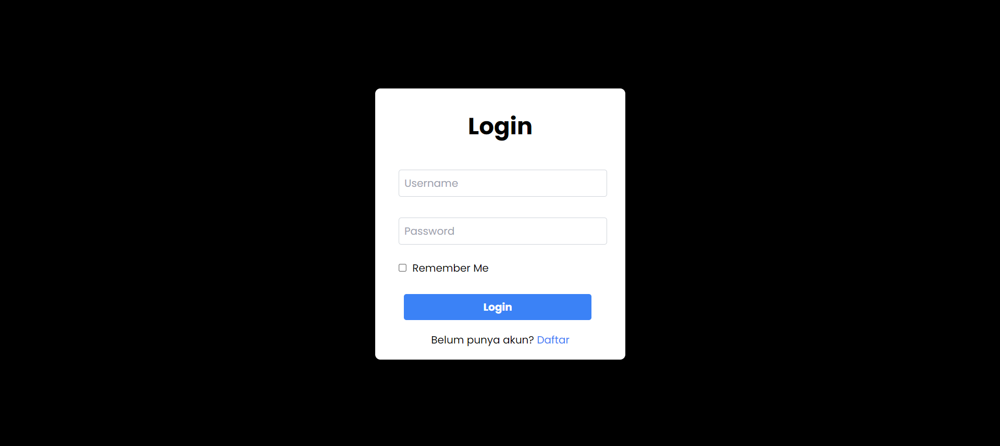
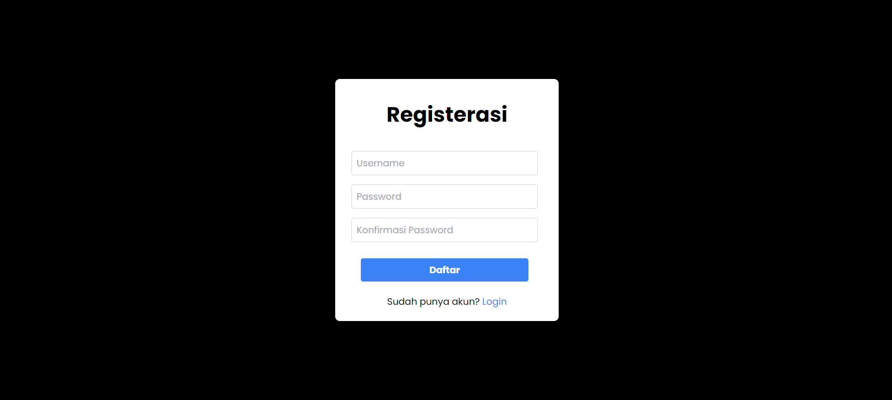
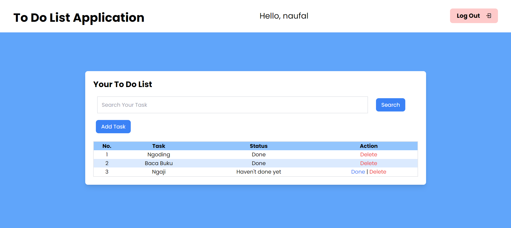
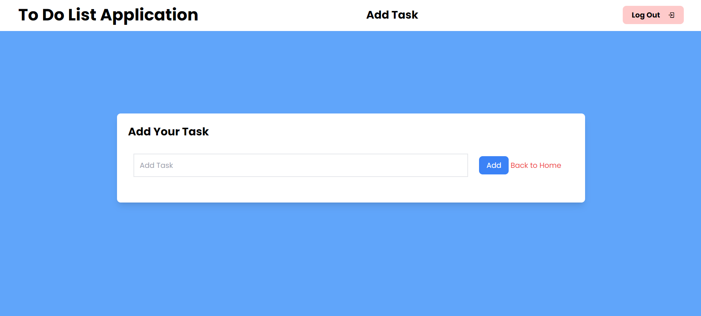

# To-Do List Application

This is a simple To-Do List application built using HTML, PHP, JavaScript, and Tailwind CSS.

## Author
Naufal Ma'ruf Ashrori

## Screenshots
### Login


### Register


### Home


### Add Task


## Technologies Used
- HTML
- PHP
- JavaScript
- Tailwind CSS

## Database
- MySQL

## Installation Guide
Follow these steps to set up and run the To-Do List Application:

1. **Clone the repository:**
  ```
  git clone https://github.com/naufal225/application-to-do-list-php.git
  ```


2. **Import Database:**
- Create a MySQL database named `todo_list`.
- Import the SQL file `database/todo_list.sql` into your database.

3. **Configure Database Connection:**
- Open `config/db.php`.
- Update the database connection details (`DB_HOST`, `DB_USER`, `DB_PASS`, `DB_NAME`) according to your MySQL configuration.

4. **Start the Application:**
- Navigate to the project directory.
- Start your PHP development server:
  
  ```
  php -S localhost:8000
  ```

5. **Access the Application:**
- Open your web browser and go to  `http://localhost:8000`.

6. **Login Credentials:**
Log in with your credentials. If you don't have an account, register.

7. **Start Managing Your Tasks:**
- You can now start managing your to-do list by adding, editing, and deleting tasks.
